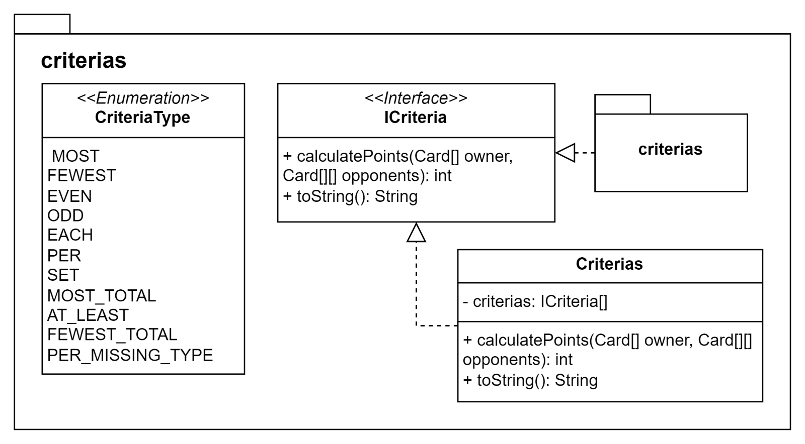

# Pointcards

Multiplayer card game currently supporting the Point Salad game mode.

> Repo: https://github.com/JonathanEkberg/pointcards

## How to run

### Requirements
* Unix based OS like Linux, MacOS (Might work on Windows with shell but not tested)
* Java 17 or higher

Tested with:

```sh
openjdk version "17" 2021-09-14
OpenJDK Runtime Environment (build 17+35-2724)
OpenJDK 64-Bit Server VM (build 17+35-2724, mixed mode, sharing)
```

running on Debian GNU/Linux 12 (bookworm) in WSL.

#### Installing java

If Java is not installed or you don't have the correct version I recommended installing with [Jabba](https://github.com/shyiko/jabba) Java version manager. Then run:
```sh
jabba install openjdk@1.17.0
jabba use openjdk@1.17.0

# If you want to set as default (So you don't have to write "jabba use ..." everytime)
jabba alias default openjdk@1.17.0
```

### Compiling
Compile the program by running the following script:

```sh
./scripts/compile.sh
```

### Running
Run the game server:
```sh
./scripts/server.sh
```

Run the game client:
```sh
./scripts/client.sh
```

### Supported arguments
You can optionally add or edit these arguments in the server and client scripts when running the Java program:

* --type - The type of program to run. Either 'server' or 'client'
* --hostname - Default: localhost The hostname to start the server on or connect the client to (can also be an IP address).
* --port - Default: 3000 The port to start the server on or connect the client to.

#### Server specific
* --manifest-path - The path to the manifest file for the game.

(Below are optional)

* --players - The number of human players (including yourself) the game should have
* --bots - The number of bots the game should have
> If provided then 2 <= players + bots <= 6 when running Point Salad game mode

### Logging level

The level of logs to have in the console can be set with the LOGGER_LEVEL environment variable.
The log levels are 'debug', 'info', 'warn' and 'error'.
If debug is selected debug and levels above will be logged and if 'info' it and all above will log etc.

### Testing
Run all unit tests with:
```sh
./scripts/test.sh
```

## Developing

### Restore git history

If you don't have access to GitHub the repo with its history can be recreated with:
```sh
git clone ./pointcards.bundle pointcards-with-history
```

The folder 'pointcards-with-history' will then have all the code + .git for commit history.

### Updating

When adding new game modes you can create the new game modes package in the same level as the "pointsalad" package.
So for Point City game mode you could create a "pointcity" package.
Then implement the game factory for it along with all the required components which the game might use and update the game factory used in [Main.java](./src/pointcards/Main.java).
Never import anything between the game mode packages. So for example, no classes from the "pointsalad" package should not import from "poincity" package and vice versa.

Unit tests can be added by adding test classes in the "test" package at the same level as 'TestCriteria.java'.

### Code UML diagrams



